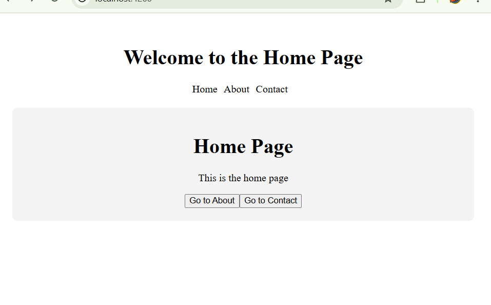

# 📌 Angular Routing Project (Third Project)

This project demonstrates a basic **Routing-based Angular Application**, where you navigate between **Home**, **About**, and **Contact** pages using Angular Router.

---

## 🔍 Key Features Observed
- 🧭 Navigation Menu (Home | About | Contact)
- 🙌 Welcome Message
- 🔄 Dynamic Routing using `<router-outlet>`
- 🧭 Page-based Navigation Buttons (Go to About / Contact / Home)

---

## 💡 What This Project Teaches You

| Concept | Description |
|--------|-------------|
| Angular Routing | How to set up page navigation using Angular's RouterModule |
| Components | Separate Home, About, and Contact components |
| Router Links | `<a routerLink="/about">About</a>` and programmatic navigation using `router.navigate` |
| Router Outlet | Acts as a placeholder to render route content dynamically |

---

## 📁 Typical Project Structure
```
src/
├── app/
│   ├── home/
│   │   └── home.component.ts / html / css
│   ├── about/
│   │   └── about.component.ts / html / css
│   ├── contact/
│   │   └── contact.component.ts / html / css
│   ├── app-routing.module.ts
│   └── app.component.ts / html / css
```

---

## 🛠 Sample Code Breakdown

### 1️⃣ app-routing.module.ts
```ts
import { NgModule } from '@angular/core';
import { RouterModule, Routes } from '@angular/router';
import { HomeComponent } from './home/home.component';
import { AboutComponent } from './about/about.component';
import { ContactComponent } from './contact/contact.component';

const routes: Routes = [
  { path: '', component: HomeComponent },
  { path: 'about', component: AboutComponent },
  { path: 'contact', component: ContactComponent },
  { path: '**', redirectTo: '' }
];

@NgModule({
  imports: [RouterModule.forRoot(routes)],
  exports: [RouterModule]
})
export class AppRoutingModule { }
```

---

### 2️⃣ app.component.html
```html
<div class="container">
  <h1> Welcome to the Home Page</h1>
  <nav>
    <a routerLink="/">Home</a>
    <a routerLink="/about">About</a>
    <a routerLink="/contact">Contact</a>
  </nav>
  <router-outlet></router-outlet>
</div>

<style>
  .container {
    text-align: center;
    padding: 20px;
  }
  nav {
    margin-bottom: 20px;
  }
  nav a {
    margin-right: 10px;
  }
</style>
```

---

### 3️⃣ home.component.html
```html
<div class="container">
    <h1>Home Page</h1>  
    <p>This is the home page</p>
    <button (click)="navigateToAbout()">Go to About</button>
    <button (click)="navigateToContact()">Go to Contact</button>
</div>

<style>
    .container {
        background-color: #f4f4f4;
        padding: 20px;
        border-radius: 8px;
    }
</style>
```

---

### 4️⃣ about.component.html
```html
<div class="container">
    <h1>About Page</h1>
    <p>This is the about page</p>
    <button (click)="navigateToHome()">Go to Home</button>
</div>

<style>
    .container {
        background-color: #f4f4f4;
        padding: 20px;
        border-radius: 8px;
    }
</style>
```

---

### 5️⃣ contact.component.html
```html
<div class="container">
    <h1>Contact Page</h1>
    <p>This is the contact page</p>
    <button (click)="navigateToHome()">Go to Home</button>
</div>

<style>
    .container {
        background-color: #f4f4f4;
        padding: 20px;
        border-radius: 8px;
    }
</style>
```

---

## 🎨 Styling (Optional Enhancements)
```css
nav a {
  margin: 0 10px;
  text-decoration: none;
  font-weight: bold;
}

.container {
  padding: 20px;
  border-radius: 8px;
}
```

---

## 📸 Screenshot

<p align="center">
  
</p>

---

## 🚀 Summary
This project teaches the essentials of Angular routing and component-based architecture. It's a great beginner project for understanding Angular Router functionality.
